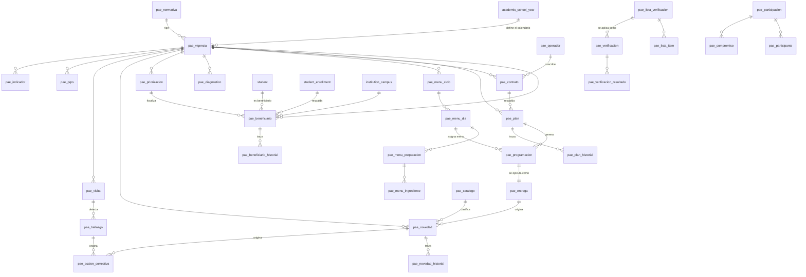

# Módulo de Gestión Integral del PAE — Arquitectura técnica

Documentación técnica del **Programa de Alimentación Escolar** dentro de
PL_SGE: qué se reutilizó de la plataforma, qué se agregó, cómo está modelado y
cómo se hace cumplir cada regla.

---

## 1. Arquitectura actual de la plataforma (lo que ya existía)

| Capa | Pieza | Ubicación |
|---|---|---|
| Configuración | Django 5.2 + DRF 3.18, PostgreSQL, JWT + sesión + TOTP | `config/settings.py` |
| Permisos | Motor por **módulo × acción** (`view/create/edit/delete/export/approve`) con caché | `config/permissions.py` |
| API | `BaseModelViewSet`: auditoría, borrado lógico, exportación, `options/`, `stats/` | `config/viewsets.py` |
| Páginas CRUD | `ResourceView` declarativa → JSON → `crud.js` construye tabla, filtros y formulario | `config/resource.py` |
| Modelos base | `TimeStampedModel`, `AuditableModel`, `SoftDeleteModel`, `UUIDModel`, `BaseModel`, `CatalogModel` | `config/models_base.py` |
| Navegación y permisos | `MODULE_REGISTRY` y `DEFAULT_ROLE_MATRIX` como única fuente de verdad | `core/configuration/modules.py` |
| Diseño | Tokens en `variables.css`, componentes en `components.css`, gráficas SVG propias | `static/css`, `static/js/modules/charts.js` |
| Auditoría | `AuditLog` + middleware de trazabilidad | `core/audit/` |

El PAE se montó **sobre** esta arquitectura. No se introdujo ningún framework,
librería de gráficas, color ni componente visual nuevo.

---

## 2. Arquitectura propuesta y aplicada

```
core/pae/
├── models.py       36 modelos, todos sobre BaseModel / CatalogModel
├── services.py     las 12 reglas de negocio, el tablero y las alertas
├── serializers.py  delega toda validación en services
├── api.py          36 ViewSets + 5 endpoints especializados
├── imports.py      importadores CSV/XLSX del módulo
├── views.py        22 páginas HTML sobre ResourceView / ModulePageView
├── urls.py         rutas bajo /pae/
├── signals.py      trazabilidad automática de estados y vencimientos
├── admin.py        administración técnica
└── tests/          177 pruebas

config/imports.py   motor de importación y validación de archivos (compartido)
templates/pae/      17 plantillas sobre el layout existente
static/js/modules/  pae-actions · pae-dashboard · pae-delivery · pae-checklist
```

### Principio rector: reutilizar antes que duplicar

| Necesidad del PAE | Decisión | Por qué |
|---|---|---|
| Calendario del programa | `pae_vigencia` **referencia** `academic_school_year` | El año lectivo ya define el calendario institucional |
| Estudiantes beneficiarios | `pae_beneficiario` **referencia** `student` + `student_enrollment` | El estudiante pertenece al módulo de Estudiantes; el PAE solo establece la relación de beneficiario |
| Sedes y jornadas | FK a `institution_campus` / `institution_shift` | Ya son la estructura física de la institución |
| Doce listas normativas | Una sola tabla `pae_catalogo` con `catalog_type` | Evita diez tablas casi idénticas y permite agregar listas sin migrar |
| Bitácora del módulo | `/api/audit-logs/?module_prefix=pae` | La bitácora general ya registra todo; solo faltaba acotarla |
| Tabla, filtros y formularios | `ResourceView` + `crud.js` | El CRUD declarativo ya existía |
| Gráficas del tablero | `modules/charts.js` | Ya había gráficas SVG propias, sin dependencias |
| Exportación XLSX/CSV | `ExportMixin` | Ya existía en `BaseModelViewSet`; se extrajo para compartirla |

### Cambios sobre piezas compartidas

Fueron tres, todos aditivos y con beneficio para el resto de la plataforma:

1. **`ResourceView.base_params`** — parámetros fijos que `crud.js` envía en cada
   consulta y exportación. Permite que la auditoría del PAE reutilice
   `/api/audit-logs/` acotada por dominio, en lugar de crear una bitácora propia.
2. **`ExportMixin`** — la exportación pasó de `BaseModelViewSet` a un mixin que
   también usa `ReadOnlyBaseViewSet`. Corrige de paso que
   `/api/audit-logs/export/` respondía 500, y añade el registro de la
   exportación en la bitácora para **todos** los módulos.
3. **`config/imports.py`** — motor de importación y validación de archivos,
   disponible para cualquier módulo.

---

## 3. Modelo de datos

39 tablas `pae_*` (36 modelos + 3 tablas puente de relaciones muchos a muchos).
Todas heredan las columnas de trazabilidad de la plataforma: `created_at`,
`updated_at`, `created_by_id`, `updated_by_id`, `deleted_at`, `deleted_by_id`,
`is_active` y `uuid`. **El borrado es lógico en todo el módulo.**

### 3.1 Modelo entidad-relación



### 3.2 Diccionario de datos

| Tabla | Qué guarda | Claves y reglas propias |
|---|---|---|
| `pae_normativa` | Versión normativa aplicable | `code` único; estado `VIGENTE` / `POR_VALIDAR` / `DEROGADO` |
| `pae_catalogo` | Doce listas parametrizables | Único `(catalog_type, code)`; `weight`, `requires_evidence`, `requires_action`, `metadata` |
| `pae_modalidad` | Modalidad de atención | Único `(institution, code)`; exige cocina / comedor / cadena de frío |
| `pae_tipo_complemento` | Tipo de complemento | Único `(institution, code)`; aporte calórico y % del requerimiento **parametrizables** |
| `pae_vigencia` | Vigencia del programa | Único `(institution, school_year)`; una sola `is_current`; metas de cobertura y cumplimiento |
| `pae_diagnostico` | Diagnóstico de la sede | Único `(vigencia, campus)`; 11 condiciones ponderadas → `score` y `result` |
| `pae_priorizacion` | Focalización de población | Criterios M2M sobre `pae_catalogo`; estados `BORRADOR` → `APROBADA` |
| `pae_beneficiario` | Vínculo estudiante ↔ programa | **Único `(vigencia, student)`**; deriva sede, grado y jornada de la matrícula |
| `pae_beneficiario_historial` | Trazabilidad del beneficiario | Escrito por señal; una fila por transición |
| `pae_operador` | Operador del servicio | `nit` único; único `(institution, code)` |
| `pae_contrato` | Contrato con el operador | Único `(vigencia, number)`; `alert_days` para el aviso de vencimiento |
| `pae_plan` | Plan operativo por sede | Único `(vigencia, campus, name)`; `code` automático; máquina de estados |
| `pae_plan_historial` | Trazabilidad del plan | Estado anterior, nuevo, motivo y usuario |
| `pae_menu_ciclo` | Ciclo de menú versionado | Único `(vigencia, code, version)`; `parent_version` encadena las versiones |
| `pae_menu_dia` | Día del ciclo | Único `(cycle, day_number)`; `total_calories` calculado |
| `pae_menu_preparacion` | Preparación del día | Componente, porción, calorías y proteína |
| `pae_menu_ingrediente` | Ingrediente de la preparación | Cantidad, unidad y grupo de alimento |
| `pae_programacion` | Programación diaria | Único `(plan, service_date, campus, shift, complement_type)` |
| `pae_entrega` | Entrega efectiva | Misma clave única; `missing`, `undelivered` y `compliance` **calculados, no editables** |
| `pae_lista_verificacion` | Lista de verificación | `code` único; umbrales de cumplimiento **parametrizables** |
| `pae_lista_item` | Criterio verificable | Peso, criticidad y exigencia de evidencia |
| `pae_verificacion` | Aplicación de la lista | Puntaje ponderado; un crítico incumplido fuerza `NO_CUMPLE` |
| `pae_verificacion_resultado` | Respuesta a un criterio | Único `(verification, item)` |
| `pae_visita` | Visita de seguimiento | Estados `PROGRAMADA` → `CERRADA` |
| `pae_hallazgo` | Hallazgo detectado | Severidad `LEVE` … `CRITICO` |
| `pae_novedad` | Novedad de la operación | Máquina de estados de 6 pasos; `number` automático |
| `pae_novedad_historial` | Trazabilidad de la novedad | Una fila por transición |
| `pae_accion_correctiva` | Plan de mejoramiento | Exige verificación y evidencia para cerrar |
| `pae_pqrs` | Peticiones, quejas y reclamos | `filing_number` automático; `due_date` para el vencimiento legal |
| `pae_participacion` | Reunión de participación | Acta, orden del día y acuerdos |
| `pae_participante` | Asistente a la reunión | Calidad en que asiste |
| `pae_compromiso` | Compromiso adquirido | Asociable a visita o reunión |
| `pae_documento` | Repositorio documental | Versionado; alerta por vencimiento |
| `pae_evidencia` | Evidencia adjunta | Referencia ligera `module` + `reference_id` |
| `pae_indicador` | Indicador calculado | Único `(vigencia, campus, code, period_label)` |
| `pae_reporte` | Informes generados | Registro de las generaciones |

---

## 4. Las 12 reglas de negocio

Viven en `core/pae/services.py`, de modo que **la regla no depende de la
interfaz que la dispare**: la aplican por igual la API, la importación masiva,
las páginas y los comandos.

| # | Regla | Dónde |
|---|---|---|
| 1 | La sede de la entrega debe pertenecer al plan o a su contrato | `validate_delivery` |
| 2 | No se pueden entregar más raciones de las recibidas | `validate_delivery` |
| 3 | Todo incumplimiento (faltantes, no entregadas o menú distinto) exige justificación | `validate_delivery` |
| 4 | No se cierra una novedad sin registrar la solución aplicada | `validate_incident_close` |
| 5 | No se cierra una acción de mejora sin verificación y, si lo exige, sin evidencia | `validate_action_close` |
| 6 | Un plan aprobado, en ejecución o cerrado solo lo modifica quien tiene permiso de aprobación | `validate_plan_edit` |
| 7 | El beneficiario debe ser un estudiante existente y activo | `validate_beneficiary` |
| 8 | Un estudiante no puede ser beneficiario dos veces en la misma vigencia | `validate_beneficiary` |
| 9 | Los contratos y documentos próximos a vencer o vencidos generan alerta | `build_alerts` |
| 10 | Las novedades, acciones y PQRS fuera de plazo generan alerta | `build_alerts` |
| 11 | Todo cambio de estado deja historial con usuario, fecha y motivo | `change_*_status` + `signals.py` |
| 12 | Los indicadores se recalculan de la operación registrada, nunca se digitan | `refresh_indicators` |

### Cálculos automáticos

```
faltantes      = programadas − recibidas
no entregadas  = recibidas   − entregadas
cumplimiento   = entregadas  / programadas × 100
cobertura      = beneficiarios activos / matrícula activa × 100
```

Los campos calculados son `editable=False` y se recalculan en `save()`: el
cliente no los puede fijar (verificado en `test_audit.py`).

---

## 5. Seguridad

| Control | Implementación |
|---|---|
| Autorización | Tres capas: `ModulePermissionRequiredMixin` (HTML), `HasModulePermission` (API) y filtrado del menú. **Ocultar el botón nunca es el control** |
| Alcance por sede | `PaeScopedViewSet` acota la consulta a las sedes del usuario para `COORDINADOR_SEDE` y `OPERADOR_PAE` |
| Mínimo privilegio | Seis perfiles con matriz por módulo y acción; el perfil de consulta no exporta |
| Inyección SQL | ORM y consultas parametrizadas; probado con cargas hostiles |
| XSS | Autoescape de Django y `escapeHtml` en el JS |
| CSRF | Middleware de Django; probado con `enforce_csrf_checks` |
| Archivos | Extensión, tipo y tamaño validados en el servidor (`config/imports.py`); 5 MB para importaciones, 10 MB para soportes |
| Auditoría | Solo lectura desde la aplicación: crear, editar o eliminar entradas responde 403/405 |
| Trazabilidad | Creación, modificación, borrado, aprobación, exportación e importación quedan registradas |

---

## 6. Parametrización normativa

El módulo **no codifica valores normativos de forma rígida**:

- Los aportes calóricos, umbrales, plazos y criterios son filas de
  `pae_catalogo`, `pae_tipo_complemento` y `pae_lista_verificacion`.
- Cada valor de origen normativo se registra con estado `POR_VALIDAR` hasta que
  se confirme contra el texto oficial, y se ajusta desde la interfaz sin tocar
  el código.
- `pae_vigencia.normative` guarda **bajo qué norma** se produjo cada registro,
  de modo que un cambio normativo no reescribe la historia.

Las normas de referencia cargadas por `seed_pae` (Resolución 0003 del 7 de
enero de 2026 y Resolución 0155 del 8 de abril de 2026, UApA — Alimentos para
Aprender) quedan en estado `POR_VALIDAR`: sus parámetros numéricos deben
confirmarse contra el texto publicado antes de operar en producción.

---

## 7. Pruebas

177 pruebas en `core/pae/tests/`, con casos positivos y negativos:

| Archivo | Cubre |
|---|---|
| `test_models.py` | Cálculos de la entrega, puntaje de verificación, versionado de menús, diagnóstico y estados |
| `test_services.py` | Las 12 reglas de negocio |
| `test_api.py` | Que la API aplique las mismas reglas, incluida la planilla diaria |
| `test_permissions.py` | Los seis perfiles en HTML y API, y el alcance por sede |
| `test_audit.py` | Trazabilidad, inmutabilidad de la bitácora, SQL injection, XSS, CSRF |
| `test_imports.py` | Errores por fila y columna, duplicados y validación de archivos |

```bash
python manage.py test core.pae
python smoke_test.py
```

---

## 8. Endpoints

| Método | Ruta | Función |
|---|---|---|
| GET | `/api/pae/dashboard/` | Tablero con filtros por vigencia, sede, jornada, operador y fechas |
| GET/POST | `/api/pae/alertas/` | Alertas operativas; POST las notifica |
| GET/POST | `/api/pae/planilla-entregas/` | Planilla diaria; POST guarda en bloque aplicando las reglas 1, 2 y 3 |
| GET/POST | `/api/pae/hoja-verificacion/` | Criterios agrupados y umbrales; POST guarda y recalcula |
| GET/POST | `/api/pae/importar/` | Plantillas e importación masiva |
| — | `/api/pae/<recurso>/` | 36 recursos CRUD con `options/`, `stats/` y `export/` |

Acciones de negocio: `vigencias/{id}/set-current`, `vigencias/{id}/refresh-indicators`,
`priorizaciones/{id}/enroll-beneficiaries`, `beneficiarios/{id}/change-status`,
`planes/{id}/transition`, `planes/{id}/sync-beneficiaries`, `menus/{id}/new-version`,
`menus/{id}/publish`, `programacion/generate`, `entregas/{id}/create-incident`,
`novedades/{id}/estado`, `hallazgos/{id}/create-action`, `mejoramiento/{id}/close`.
