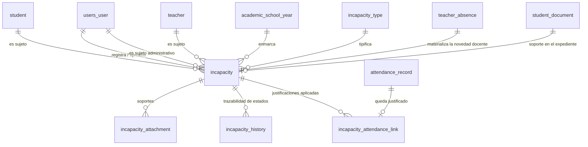
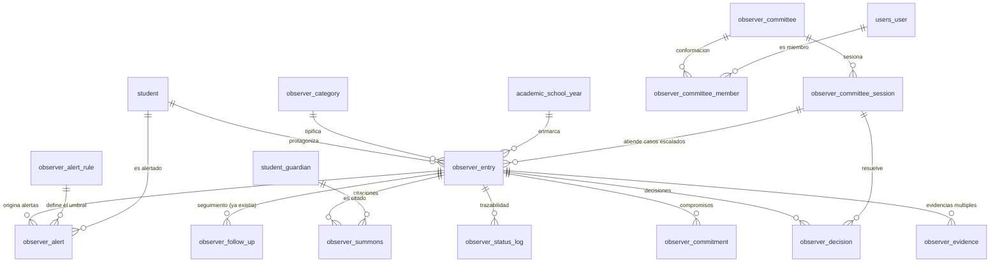
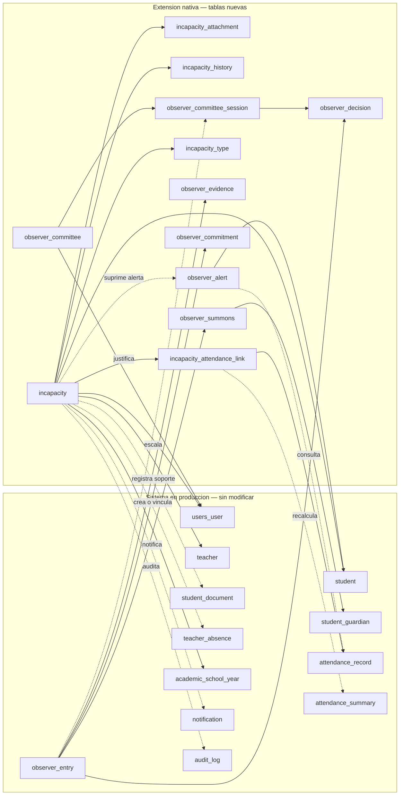

# Entregable 4 — Modelo Entidad-Relación

**14 tablas nuevas** · **0 tablas productivas modificadas** · **41 llaves
foráneas hacia entidades existentes**

Convención heredada del sistema: `id bigint` autoincremental como llave
primaria, borrado lógico (`deleted_at`), auditoría (`created_by_id`,
`updated_by_id`, `deleted_by_id`) y `uuid` público en toda tabla de dominio.

---

## 1. Módulo de Incapacidades — 5 tablas



### Entidades y cardinalidades

| Relación | Cardinalidad | Regla |
|---|---|---|
| `incapacity_type` → `incapacity` | 1 : N | Un tipo clasifica muchas incapacidades |
| `student` → `incapacity` | 1 : N | Un estudiante puede tener varias, no traslapadas |
| `teacher` → `incapacity` | 1 : N | Ídem para docentes |
| `users_user` → `incapacity` | 1 : N | Sujeto administrativo |
| `incapacity` → `incapacity_attachment` | 1 : N | Al menos uno si el tipo lo exige |
| `incapacity` → `incapacity_history` | 1 : N | Una fila por transición |
| `incapacity` → `incapacity_attendance_link` | 1 : N | Un vínculo por registro justificado |
| `attendance_record` → `incapacity_attendance_link` | 1 : 1 | Un registro solo lo justifica una incapacidad vigente |
| `incapacity` → `teacher_absence` | 1 : 0..1 | Solo cuando el sujeto es docente y se aprueba |

### Restricción del sujeto polimórfico

```sql
CONSTRAINT ck_incapacity_subject CHECK (
    (subject_type = 'ESTUDIANTE'     AND student_id IS NOT NULL AND teacher_id IS NULL     AND subject_user_id IS NULL) OR
    (subject_type = 'DOCENTE'        AND teacher_id IS NOT NULL AND student_id IS NULL     AND subject_user_id IS NULL) OR
    (subject_type = 'ADMINISTRATIVO' AND subject_user_id IS NOT NULL AND student_id IS NULL AND teacher_id IS NULL)
)
```

Garantiza **exactamente un sujeto** con integridad referencial real, sin campos
genéricos `objeto_id` que romperían las llaves foráneas.

### Índices recomendados

| Índice | Columnas | Motivo |
|---|---|---|
| `ix_incapacity_student_date` | `(student_id, start_date DESC)` | Historial por estudiante |
| `ix_incapacity_teacher_date` | `(teacher_id, start_date DESC)` | Historial por docente |
| `ix_incapacity_status_year` | `(status, school_year_id)` | Bandeja de pendientes |
| `ix_incapacity_range` | `(start_date, end_date)` | Detección de traslapes |
| `ix_incapacity_subject_type` | `(subject_type)` | Filtro por tipo de sujeto |
| `ix_incapacity_number` | `(number)` UNIQUE | Consecutivo |
| `ix_inc_attachment_incapacity` | `(incapacity_id)` | Soportes del registro |
| `ix_inc_history_incapacity` | `(incapacity_id, changed_at DESC)` | Trazabilidad |
| `ix_inc_link_unique` | `(incapacity_id, attendance_record_id)` UNIQUE | Idempotencia (RN-I-06) |
| `ix_inc_link_record` | `(attendance_record_id)` | Reversión |

---

## 2. Convivencia Escolar — 9 tablas que **extienden** `observer`



> Las tablas `observer_entry`, `observer_category` y `observer_follow_up`
> **ya existen y no se modifican**. El único cambio es agregar el valor
> `ESCALADO_COMITE` a `observer_entry.status`, que **no genera DDL**.

### Entidades y cardinalidades

| Relación | Cardinalidad | Regla |
|---|---|---|
| `observer_entry` → `observer_evidence` | 1 : N | Evidencias múltiples |
| `observer_entry` → `observer_summons` | 1 : N | Citaciones y reprogramaciones |
| `student_guardian` → `observer_summons` | 1 : N | A quién se cita |
| `observer_entry` → `observer_commitment` | 1 : N | Compromisos con plazo |
| `observer_entry` → `observer_status_log` | 1 : N | Una fila por transición |
| `observer_committee` → `observer_committee_member` | 1 : N | Conformación por año lectivo |
| `observer_committee` → `observer_committee_session` | 1 : N | Sesiones |
| `observer_committee_session` → `observer_decision` | 1 : N | Decisiones de la sesión |
| `observer_entry` → `observer_decision` | 1 : N | Decisiones sobre el caso |
| `observer_committee_session` → `observer_entry` | 1 : N | Casos atendidos en la sesión |
| `observer_alert_rule` → `observer_alert` | 1 : N | Regla que disparó la alerta |
| `student` → `observer_alert` | 1 : N | Estudiante alertado |

### Índices recomendados

| Índice | Columnas | Motivo |
|---|---|---|
| `ix_obs_evidence_entry` | `(entry_id)` | Evidencias del caso |
| `ix_obs_evidence_conf` | `(is_confidential)` | Filtro de reserva |
| `ix_obs_summons_entry` | `(entry_id, scheduled_at DESC)` | Citaciones del caso |
| `ix_obs_summons_status` | `(status, scheduled_at)` | Agenda de citaciones |
| `ix_obs_commitment_entry` | `(entry_id)` | Compromisos del caso |
| `ix_obs_commitment_due` | `(status, due_date)` | Vencimientos (RN-C-07) |
| `ix_obs_committee_year` | `(school_year_id)` UNIQUE parcial | Un comité vigente por año |
| `ix_obs_member_committee` | `(committee_id, user_id)` UNIQUE | Sin miembros repetidos |
| `ix_obs_session_committee` | `(committee_id, session_date DESC)` | Sesiones |
| `ix_obs_session_number` | `(committee_id, number)` UNIQUE | Numeración del acta |
| `ix_obs_decision_entry` | `(entry_id)` | Decisiones del caso |
| `ix_obs_decision_session` | `(session_id)` | Decisiones de la sesión |
| `ix_obs_status_entry` | `(entry_id, changed_at DESC)` | Trazabilidad |
| `ix_obs_alert_student` | `(student_id, -created_at)` | Alertas del estudiante |
| `ix_obs_alert_open` | `(status, level)` | Bandeja de alertas |
| `ix_obs_rule_active` | `(is_active, rule_type)` | Evaluación de reglas |

---

## 3. Mapa de integración con el sistema existente



**Lectura del diagrama:** las flechas continuas son llaves foráneas; las
punteadas son integraciones por servicio (no crean acoplamiento estructural).
Ninguna flecha **modifica** la estructura del sistema en producción.

---

## 4. Verificación de las condiciones obligatorias

| Condición | Cumplimiento |
|---|---|
| 4. No duplicar información | Estudiantes, docentes, acudientes, asistencia y expediente se **referencian** |
| 5. No crear entidades que ya existan | El caso disciplinario sigue siendo `observer_entry`; la novedad docente sigue siendo `teacher_absence` |
| 17. Integridad referencial | 41 FK reales; el sujeto polimórfico usa FK + `CHECK`, no un id genérico |
| 14. Convenciones de nomenclatura | Prefijos `incapacity_*` y `observer_*` según el dominio, como el resto |
| 15. Auditoría completa | Todas las tablas heredan `BaseModel` |
