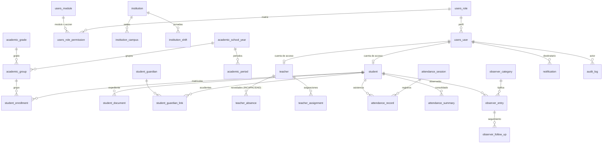

# Anexo — Sistema actual: esquema, estructura y pantallas

Documentación del sistema **tal como está en producción**, base sobre la que se
diseñó la extensión. Todo lo de este anexo es **inventario verificado contra el
código y la base de datos**, no descripción teórica.

---

## 1. Esquema de la base de datos actual (`schema.sql`)

El esquema completo, listo para ejecutar, está en el repositorio:

| Archivo | Contenido |
|---|---|
| [`database/02_esquema.sql`](../../database/02_esquema.sql) | **157 tablas · 1.593 índices · 785 llaves foráneas** |
| [`database/03_datos_iniciales.sql`](../../database/03_datos_iniciales.sql) | 14 perfiles, 128 módulos, 671 permisos, configuración |
| [`database/04_verificacion.sql`](../../database/04_verificacion.sql) | Consulta de comprobación |

No se mantiene a mano: se regenera de una base recién migrada con
`python scripts/generar_sql.py`, de modo que nunca queda desfasado respecto de
las migraciones.

### Dominios y prefijos

| Prefijo | Dominio | Tablas |
|---|---|---|
| `users_*` | Usuarios, roles, módulos, matriz de permisos | 8 |
| `auth_*` | 2FA, tokens, intentos de acceso, sesiones | 7 |
| `institution*` | Institución, sedes, jornadas, calendario | 4 |
| `configuration_*` | Encabezado de reportes, décimas, parámetros | 3 |
| `academic_*` | Año lectivo, periodos, escalas, grados, grupos, áreas | 14 |
| `student*` | Estudiantes, acudientes, matrículas, documentos | 9 |
| `teacher*` | Docentes, asignaciones, horarios, **novedades** | 5 |
| `evaluation_*` | Notas de proceso, asignatura y área | 7 |
| `attendance_*` | **Sesiones, registros y consolidados** | 3 |
| `tutoring_*` | Tutores, juicios, **convivencia**, bloqueo | 5 |
| `observer_*` | **Tipologías, anotaciones y seguimientos** | 3 |
| `promotion_*` | Cierres, promoción, boletines, comisiones | 4 |
| `recovery_*` | Planes, actividades, inscripciones | 4 |
| `emphasis*` | Énfasis, grupos y matrículas | 3 |
| `document_*` | Plantillas y documentos emitidos | 2 |
| `report_*` | Catálogo, ejecuciones e indicadores | 3 |
| `agenda_*` | Eventos, actividades y circulares | 3 |
| `classroom_*` | Cursos, unidades, materiales, entregas | 6 |
| `election*` | Procesos, cargos, candidatos, votos | 6 |
| `extension_*` | Formularios dinámicos, espacios virtuales | 4 |
| `notification` | Centro de notificaciones | 1 |
| `audit_log` | Bitácora de auditoría | 1 |
| `pae_*` | Programa de Alimentación Escolar | 39 |

**En negrita** los dominios con los que la extensión se integra.

### Columnas de trazabilidad comunes

Toda tabla de dominio comparte: `id`, `created_at`, `updated_at`, `deleted_at`,
`deleted_by_id`, `created_by_id`, `updated_by_id`, `uuid`, `is_active`.
**El borrado es lógico en todo el sistema.**

---

## 2. Diagrama ER existente — zona de integración

Solo las entidades que la extensión toca. El modelo completo está en
`database/02_esquema.sql`.



### Puntos de integración de la extensión

| Entidad existente | Cómo la usa la extensión |
|---|---|
| `student`, `teacher`, `users_user` | Sujeto de la incapacidad (FK, sin duplicar) |
| `student_enrollment` | Contexto académico del caso |
| `student_guardian` | Destinatario de citaciones |
| `attendance_record` | **Se justifica automáticamente** (solo `AUSENTE` → `EXCUSA`) |
| `attendance_summary` | Se recalcula tras justificar |
| `student_document` | Recibe el soporte médico del estudiante |
| `teacher_absence` | Se **crea o vincula** al aprobar (1:1, sin duplicar) |
| `observer_entry` | **Es** el caso disciplinario; la extensión le cuelga las piezas faltantes |
| `notification` | `Notification.push()` para todos los avisos |
| `audit_log` | Trazabilidad automática |

---

## 3. Estructura de carpetas del backend

```
PL_SGE/
├── manage.py
├── requirements.txt
├── smoke_test.py                    Prueba de humo de rutas y endpoints
│
├── config/                          Nucleo de infraestructura
│   ├── settings.py                  Configuracion completa
│   ├── urls.py                      Enrutamiento maestro
│   ├── api.py                       Router REST agregador
│   ├── permissions.py               Motor de permisos modulo x accion
│   ├── viewsets.py                  BaseModelViewSet, ReadOnlyBaseViewSet, ExportMixin
│   ├── resource.py                  ResourceView: paginas CRUD declarativas
│   ├── models_base.py               BaseModel, CatalogModel, SoftDeleteModel
│   ├── imports.py                   Motor de importacion y validacion de archivos
│   ├── pagination.py · exceptions.py · errors.py
│   └── wsgi.py · asgi.py
│
├── core/                            23 aplicaciones de dominio
│   ├── authentication/  dashboard/  configuration/  users/  institutions/
│   ├── academic/        students/   teachers/       evaluations/
│   ├── attendance/  ◄── integracion de Incapacidades
│   ├── tutoring/        observer/  ◄── se EXTIENDE para Convivencia
│   ├── promotion/       recoveries/ emphases/       documents/
│   ├── reports/         agenda/     classroom/      elections/
│   ├── extensions/      notifications/  audit/      pae/
│   │
│   └── incapacities/    ◄── NUEVA (unica app que se agrega)
│
├── templates/
│   ├── layouts/                     base · auth · dashboard
│   ├── partials/                    resource_page · print_header · print_toolbar
│   └── <modulo>/                    Vistas especializadas
│
├── static/
├── database/                        Scripts SQL y respaldos
│   └── extension/                   ◄── NUEVA: migracion y rollback
├── docs/
│   └── extension/                   ◄── NUEVA: entregables de este diseno
├── scripts/ · fixtures/ · media/ · logs/
```

### Archivos por aplicación (patrón que replica la extensión)

Verificado en `core/observer/`:

```
core/<app>/
├── __init__.py
├── apps.py           Configuracion de la app
├── models.py         Modelos sobre BaseModel / CatalogModel
├── serializers.py    Delegan la validacion en services
├── api.py            ViewSets + lista ROUTES
├── views.py          Paginas sobre ResourceView / ModulePageView
├── urls.py           Rutas HTML con app_name
├── admin.py          Administracion tecnica
└── migrations/
```

La extensión agrega además `services.py` (reglas de negocio centralizadas) y
`tests/`, siguiendo el patrón que ya usa `core/pae/`.

---

## 4. Estructura de carpetas del frontend

No hay framework: **HTML5 + CSS3 con tokens + JavaScript ES6 nativo**.

```
static/
├── css/
│   ├── variables.css      Tokens de diseno: colores, tipografia, espaciado,
│   │                      radios, sombras. Temas claro y oscuro.
│   │                      ◄── LA EXTENSION NO AGREGA NI UN COLOR AQUI
│   ├── app.css            Layout: shell, sidebar, topbar, grid, utilidades
│   ├── components.css     Componentes: card, table, badge, btn, drawer, modal,
│   │                      alert, form, tabs, timeline, progress, empty-state
│   └── responsive.css     Puntos de quiebre; responsive hasta 375 px
│
├── js/
│   ├── app.js             Nucleo: api, toast, Drawer, confirmDialog, icon,
│   │                      formatNumber, formatDate, escapeHtml, tema
│   ├── auth.js            Login, 2FA, recuperacion
│   ├── dashboard.js       Tablero principal
│   └── modules/
│       ├── crud.js        Motor CRUD declarativo (tabla, filtros, formulario)
│       ├── charts.js      Graficas SVG propias, sin librerias
│       ├── pae-*.js       Modulos especializados del PAE
│       └── incapacities.js · coexistence.js   ◄── NUEVOS
│
├── icons/ · images/ · vendor/
│
templates/
├── layouts/
│   ├── base.html          Documento base
│   ├── auth.html          Pantallas de autenticacion
│   └── dashboard.html     Shell con sidebar, topbar y notificaciones
│                          ◄── LA EXTENSION LO REUTILIZA SIN MODIFICARLO
├── partials/
│   ├── resource_page.html Pagina CRUD generica
│   ├── print_header.html  Encabezado institucional para impresion
│   └── print_toolbar.html Barra de impresion
└── <modulo>/              Un directorio por modulo
    └── incapacities/ · coexistence/   ◄── NUEVOS
```

### Componentes visuales que la extensión reutiliza

`card` · `table` · `badge` (6 tonos) · `btn` (7 variantes) · `drawer` · `modal`
· `alert` (5 tonos) · `form-grid` · `field` · `tabs` · `timeline` · `progress` ·
`stat-card` · `empty-state` · `skeleton` · `toast` · `pagination`

**Cero componente nuevo. Cero color nuevo.**

---

## 5. Pantallas del sistema actual

> **Sobre las capturas de pantalla:** el panel de navegador de este entorno no
> está disponible para renderizar imágenes, así que **no pude generar capturas**.
> En su lugar entrego el inventario **verificado ejecutando cada ruta con sesión
> de Super Admin**: 138 pantallas, con su código de respuesta y su título real.
> Al final indico cómo capturarlas usted mismo en dos minutos.

### Resumen

| Módulo | Pantallas |
|---|---|
| PAE | 38 |
| Directiva (academic) | 13 |
| Estudiantes | 10 |
| Usuarios | 10 |
| Autenticación | 7 |
| Docentes · Evaluaciones · Elecciones · Tutoría | 5 c/u |
| Agenda · Aula Virtual · Configuración · Recuperaciones | 4 c/u |
| Énfasis · Extensiones · Observador · Promoción · Reportes | 3 c/u |
| Asistencia · Auditoría · Documentos · Institución | 2 c/u |
| Dashboard | 1 |
| **Total** | **138** |

### Pantallas de la zona de integración

| Ruta | Título | Relación con la extensión |
|---|---|---|
| `/observador/` | Registro de Observaciones | **Es** el caso disciplinario; se extiende |
| `/observador/tipos/` | Tipos de Observación | Tipifica LEVE/GRAVE/MUY_GRAVE (Tipo I/II/III) |
| `/observador/historial/` | Historial Estudiantil | Historial disciplinario que **no se duplica** |
| `/tutoria/convivencia/` | Convivencia | Evaluación de convivencia por el tutor |
| `/directiva/convivencia/` | Convivencia | Ítems de convivencia del boletín |
| `/asistencia/` | Registro de Asistencia | Recibe la justificación automática |
| `/asistencia/reporte/` | Reporte de Inasistencias | Refleja las justificadas |
| `/docentes/` | Registro Docente | Sujeto docente de la incapacidad |
| `/estudiantes/hoja-de-vida/` | Hoja de Vida | Recibe el soporte médico |
| `/configuracion/perfiles/` | Acceso de Perfiles | Donde se administra la matriz nueva |
| `/auditoria/` | Bitácora de Acciones | Registra las operaciones nuevas |

> Nótese que **ya existen tres pantallas de convivencia**. Ese es el sustento
> de la decisión de extender en lugar de crear un módulo paralelo.

### Cómo capturar las pantallas usted mismo

```bash
python manage.py runserver
```

Entre a `http://localhost:8000/` con `admin@datly.local` / `Admin123*` y
recorra las rutas de la tabla anterior. Para capturar:

- **Windows:** `Win + Shift + S`
- **Página completa en Chrome/Edge:** `F12` → `Ctrl+Shift+P` → *Capture full size screenshot*

Sugiero capturar estas ocho, que son las que sustentan el diseño:

1. `/dashboard/` — tablero y menú lateral (consistencia visual a replicar)
2. `/observador/` — el caso disciplinario que se extiende
3. `/observador/tipos/` — la tipificación que ya existe
4. `/asistencia/` — punto de integración de Incapacidades
5. `/docentes/` — sujeto docente
6. `/configuracion/perfiles/` — matriz de permisos
7. `/auditoria/` — bitácora
8. `/pae/` — ejemplo de una extensión previa ya integrada

---

## 6. Estado de verificación de este anexo

| Afirmación | Cómo se verificó |
|---|---|
| 157 tablas, 1.593 índices, 785 FK | Consulta a `information_schema` |
| 138 pantallas HTML | Recorrido con `Client` autenticado |
| Estructura de carpetas | `find` sobre el repositorio |
| Componentes disponibles | Extracción de clases de `components.css` |
| `observer` cubre el caso disciplinario | Lectura de `core/observer/models.py` |
| `teacher_absence` ya tiene `INCAPACIDAD` | Lectura de `core/teachers/models.py` |
| `attendance_record` tiene `EXCUSA` | Lectura de `core/attendance/models.py` |
| Los scripts SQL corren y revierten | Aplicados y revertidos en una base real |
